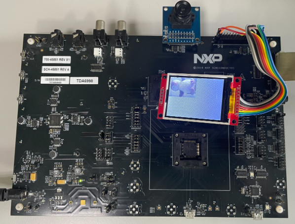

# NXP Application Code Hub

## AN12686: Using FlexIO to emulate Parallel Camera Interface on i.MX RT
This application note describes how to use the FlexIO to emulate the parallel camera interface to receive real-time image data from a camera device based on i.MX RT1010. 

Due to the limited RAM buffer size, the frame size is configured to QQVGA (160*120).

Please refer to [AN12686](https://www.nxp.com/docs/en/application-note/AN12686.pdf) for complete instructions on how to use this software. 

FlexIO is highly configurable. It allows you to implement a variety of functions, including:
- Emulation of serial communication interfaces, such as UART, SPI, I2C, I2S, and so on.
- Emulation of parallel communication interfaces, such as the camera interface, Motorola 68K bus, Intel 8080 bus, and so
on.
- Generation of PWM waveforms.
- Implementation of logic functions.
- Implementation of state-machine functions.

#### Boards: EVBMIMXRT1010
#### Categories: Graphics, Vision
#### Peripherals: I2C, SPI, VIDEO
#### Toolchains: IAR

## Table of Contents
1. [Software](#step1)
2. [Hardware](#step2)
3. [Setup](#step3)
4. [Results](#step4)
5. [FAQs](#step5) 
6. [Support](#step6)
7. [Release Notes](#step7)

## 1. Software
This demo is built based on NXP MCUXpresso SDK. And this repository contains all required source files.
- MCUXpresso SDK: 2.5.0
- IAR Embedded Workbench for ARM: 9.30.1

## 2. Hardware
- EVBMIMXRT1010 Rev A board
- OV7670 camera module
- ILI9341 LCD module
- Personal Computer
- J-Link Debugger
- Micro USB cable

## 3. Setup
1. Prepare the EVBMIMXRT1010 board:
   - short R45 pin2 & pin3;
   - short R46 pin2 & pin3;
   - short R47 pin2 & pin3;
   - short R51 pin2 & pin3;
   - short R52 pin2 & pin3;
   - short R56 pin2 & pin3;
   - short R70 pin2 & pin3;
   - short J33 pin3 & pin4, pin5 & pin6, pin7 & pin8 with jumpers;
   - short J34 pin4 & pin5, pin7 & pin8, pin10 & pin11, pin13 & pin14, pin16 & pin17 with jumpers;
   - short J35 pin1 & pin2, pin4 & pin5, pin7 & pin8, pin10 & pin11, pin13 & pin14, pin16 & pin17 with jumpers;
2. Connect the OV7670 camera module with J45 of EVBMIMXRT1010.
3. Connect the ILI9341 LCD module with J46 pins of EVBMIMXRT1010 by using wires.

    |    EVBMIMXRT1010        |   ILI9341 LCD module   |
    | -- | -- |
    |  BOOT_3V3     - J46-30  |  VCC        -  PIN1 |
    |  GND          - J46-29  |  GND        -  PIN2 |
    |  SPI_CS_Touch - J46-23  |  CS         -  PIN3  |
    |  GPIOMUX_IO7  - J46-1   |  RESET      -  PIN4  |
    |  GPIOMUX_IO8  - J46-2   |  DC/RS      -  PIN5  |
    |  SPI_SDO      - J46-26  |  SDI/MOSI   -  PIN6  |
    |  SPI_SCK      - J46-24  |  SCK        -  PIN7  |
    |  GPIO2_IO13   - J46-28  |  LED        -  PIN8  |
    |  SPI_SDI      - J46-25  |  SDO/MISO   -  PIN9  |

4. Connect J-Link debugger with J36 or J37 of EVBMIMXRT1010. 
5. Build a configuration and download the program to the target board.

## 4. Results
When the demo runs successfully, the camera frames are shown in the LCD panel.

## 5. FAQs

## 6. Support
If you have questions, please create a ticket in NXP Community.

#### Project Metadata
<!----- Boards ----->

<!----- Categories ----->
 

<!----- Peripherals ----->
  

<!----- Toolchains ----->

Questions regarding the content/correctness of this example can be entered as Issues within this GitHub repository.

>**Warning**: For more general technical questions regarding NXP Microcontrollers and the difference in expected funcionality, enter your questions on the [NXP Community Forum](https://community.nxp.com/)

## 7. Release Notes
| Version | Description / Update                           | Date                        |
|:-------:|------------------------------------------------|----------------------------:|
| 1.0     | Initial release on Application Code Hub        | August 10th 2023 |

